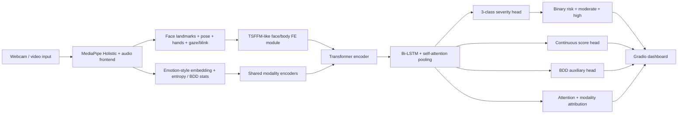

# MMDS: Multimodal Depression Screening

MMDS is a research-oriented multimodal depression screening project built around live video feature extraction, offline manifest-driven training, hybrid multimodal fusion, and a polished Gradio dashboard.

## Disclaimer

This project is a screening and research system, not a diagnostic medical device. Predictions can be wrong, biased, or unstable outside the data and hardware conditions used during experimentation.

## What Changed

- `mediapipe_full` backend for full-window face, pose, hand, gaze, blink, emotion-style, and behavioral variability features
- Hybrid fusion backbone with a TSFFM-like face/body module, Transformer encoder, Bi-LSTM, and self-attention pooling
- Manifest-first training path for DepVidMood and prepared D-Vlog / DAIC-style datasets
- Premium live dashboard with holistic overlays, risk gauge, class bars, modality contributions, and attention heatmap
- Reproducibility tooling with pinned versions, environment hashing, and explicit model downloads

## Architecture



## Quickstart

### 1. Install

```bash
python -m venv .venv
# Windows PowerShell
.\.venv\Scripts\Activate.ps1
python -m pip install -U pip
python -m pip install -e .[dev]
```

CUDA-specific Torch builds such as `torch==2.4.1+cu121` should be installed separately when you want GPU acceleration, then the rest of the project can be installed with `python -m pip install -e .[dev]`.

If you are on Python 3.12+ and cannot resolve `mediapipe==0.10.14`, the project falls back to the pinned compatibility build from `pyproject.toml`.

### 2. Verify the environment

```bash
python scripts/verify_environment.py
python scripts/check_real_data_ready.py --raw-dir data/raw --manifest data/manifests/depvidmood_feature_manifest.csv --feature-manifest artifacts/features/depvidmood_features_manifest.csv
```

### 3. Download EmoNet weights

```bash
python scripts/download_emonet_weights.py --variant 8
```

### 4. Prepare DepVidMood

```bash
bash scripts/setup_kaggle.sh
python scripts/build_depvidmood_manifest.py --raw-dir data/raw/depvidmood-facial-expression-video-dataset --output data/manifests/depvidmood_feature_manifest.csv
python scripts/extract_features.py --config configs/demo.yaml --in-manifest data/manifests/depvidmood_feature_manifest.csv --out-dir artifacts/features --out-manifest artifacts/features_manifest.csv
```

If the dataset ships a metadata CSV or JSON with explicit labels and relative video paths, prefer:

```bash
python scripts/build_depvidmood_manifest.py --raw-dir data/raw/depvidmood-facial-expression-video-dataset --metadata-csv data/raw/depvidmood-facial-expression-video-dataset/labels.csv --video-column video_path --severity-column severity --subject-column subject_id --sample-column sample_id --output data/manifests/depvidmood_feature_manifest.csv
```

### 5. Train

```bash
python scripts/train.py --config configs/research.yaml --use_real_data --real_dataset depvidmood --manifest_csv artifacts/features_manifest.csv --epochs 50 --wandb_project MMDS-Final
```

### 6. Evaluate

```bash
python scripts/evaluate.py --config configs/research.yaml --ckpt artifacts/checkpoint.pt --out artifacts/eval --use_real_data --real_dataset depvidmood --manifest_csv artifacts/features_manifest.csv
```

### 7. Run the full real-data pipeline

```bash
python scripts/run_depvidmood_pipeline.py --raw-dir data/raw/depvidmood-facial-expression-video-dataset --config configs/research.yaml --epochs 50 --artifacts-dir artifacts/depvidmood_run
```

### 8. Import a DVlog feature zip

```bash
python scripts/build_dvlog_feature_manifest.py --zip-path D:\dvlog-dataset.zip --links-csv D:\dvlog-video-links-2026.csv --out-dir artifacts/features/dvlog --out-manifest artifacts/features/dvlog_features_manifest.csv
python scripts/train.py --config configs/research.yaml --out artifacts/dvlog_run --use_real_data --real_dataset feature_manifest --manifest_csv artifacts/features/dvlog_features_manifest.csv --epochs 20 --wandb_project MMDS-DVlog
python scripts/evaluate.py --config configs/research.yaml --ckpt artifacts/dvlog_run/checkpoint.pt --out artifacts/dvlog_run/eval --use_real_data --real_dataset feature_manifest --manifest_csv artifacts/features/dvlog_features_manifest.csv
```

For the lighter binary-focused checkpoint used by the live webcam path, prefer:

```bash
python scripts/train.py --config configs/dvlog_train.yaml --out artifacts/dvlog_live_run --use_real_data --real_dataset feature_manifest --manifest_csv artifacts/features/dvlog_features_manifest.csv --epochs 12
python scripts/evaluate.py --config configs/dvlog_train.yaml --ckpt artifacts/dvlog_live_run/checkpoint.pt --out artifacts/dvlog_live_run/eval --use_real_data --real_dataset feature_manifest --manifest_csv artifacts/features/dvlog_features_manifest.csv
```

### 9. Run the live demo

```bash
python scripts/run_demo.py --config configs/space.yaml
```

For a live webcam path aligned to the DVlog-trained checkpoint, use:

```bash
python scripts/run_demo.py --config configs/live_dvlog.yaml
```

## Live Dashboard

The dashboard uses `gr.Image(..., streaming=True)` webcam streaming with latency-aware frame skipping, live holistic overlays, a risk gauge, 3-class bars, modality contribution bars, attention heatmap, rolling risk, AU trend, FPS reporting, and a strong disclaimer banner.

## Hugging Face Spaces

The Docker entrypoint is [app/gradio_app.py](/Users/HP/.codex/worktrees/1ae3/Depression-Detector/app/gradio_app.py). After authenticating with the Hugging Face CLI, upload with:

```bash
huggingface-cli upload IND-Anshuman/Multimodal-Depression-Detector --repo-type=space --space-sdk=gradio
```

## Datasets

Prepared manifests are the canonical interface. The project supports:

- DepVidMood through [`scripts/build_depvidmood_manifest.py`](/Users/HP/.codex/worktrees/1ae3/Depression-Detector/scripts/build_depvidmood_manifest.py)
- D-Vlog through prepared manifests consumed by the `dvlog` adapter
- DAIC-WOZ and E-DAIC through prepared label + manifest CSVs

### D-Vlog request template

```text
Subject: Request for D-Vlog depression dataset access

Hello,

I am working on a research project focused on multimodal depression screening from non-verbal video cues. I would like to request access to the D-Vlog dataset and any accompanying usage instructions or metadata required for academic/research evaluation.

Thank you.
```

### DAIC request template

```text
Subject: Request for DAIC-WOZ / E-DAIC access

Hello,

I am conducting research on multimodal depression screening and would like to request access to the DAIC-WOZ / E-DAIC resources for non-commercial academic experimentation. Please let me know the application steps and any data use requirements.

Thank you.
```

## Benchmarks and Verification

Run the end-of-implementation checks:

```bash
python -m pytest tests/ -q --tb=no
python benchmarks/fps_benchmark.py --config configs/space.yaml
python benchmarks/unseen_video_test.py --videos test_videos/ --threshold 0.85
```

## Reproducibility

- Key dependencies are pinned in [pyproject.toml](/Users/HP/.codex/worktrees/1ae3/Depression-Detector/pyproject.toml) and [requirements.lock](/Users/HP/.codex/worktrees/1ae3/Depression-Detector/requirements.lock)
- Training and extraction default to seed `42`
- [`scripts/verify_environment.py`](/Users/HP/.codex/worktrees/1ae3/Depression-Detector/scripts/verify_environment.py) prints package versions, platform info, git commit, and a reproducibility hash

## Repository Layout

- [src/mmds/features](/Users/HP/.codex/worktrees/1ae3/Depression-Detector/src/mmds/features)
- [src/mmds/models](/Users/HP/.codex/worktrees/1ae3/Depression-Detector/src/mmds/models)
- [src/mmds/ui](/Users/HP/.codex/worktrees/1ae3/Depression-Detector/src/mmds/ui)
- [benchmarks](/Users/HP/.codex/worktrees/1ae3/Depression-Detector/benchmarks)
- [presentation](/Users/HP/.codex/worktrees/1ae3/Depression-Detector/presentation)

## Citations

- Toisoul et al., *Estimation of continuous valence and arousal levels from faces in naturalistic conditions*, Nature Machine Intelligence, 2021
- Gimeno-Gómez et al., *Reading Between the Frames: Multi-modal Depression Detection in Videos from Non-verbal Cues*, ECIR 2024
- Additional depression-screening references from your original project plan should be listed alongside any dataset-specific citations before publication or external release
